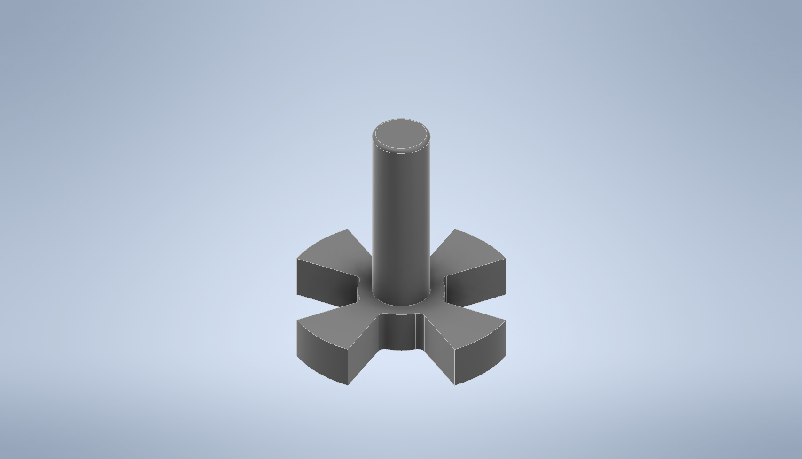

# Quadcopter-Design-Using-Inventor
## Abstract
This report presents the mechanical design process of a quadcopter using Autodesk Inventor. The aim of the project was to design a quadcopter that is stable, maneuverable, and capable of carrying a payload. The report covers the different stages of the design process, including the initial concept, CAD modeling, simulation presentation and stress analysis. The design incorporates four rotors that provide lift and stability to the quadcopter. The report discusses the design considerations, including the choice of materials, the selection of motors and propellers, and the weight distribution. The prototype was tested in various conditions, and the results show that the quadcopter is stable, responsive, and capable of carrying a payload. Overall, this report provides a comprehensive overview of the mechanical design process of a quadcopter using Autodesk Inventor and can serve as a valuable resource for anyone interested in designing and building a quadcopter.

## Objectivs
1.	To provide a comprehensive overview of the mechanical design process of a quadcopter using Autodesk Inventor.
2.	To discuss the different stages of the design process, including the initial concept, CAD modeling, and stress analysis.
3.	To describe the design considerations, including the choice of materials, and the selection of motors.
4.	To present the results of prototype testing in various conditions and demonstrate the quadcopter's stability, responsiveness, and ability to carry a payload in a simulation environment.
5.	To serve as a valuable resource for anyone interested in designing and building a quadcopter using Autodesk Inventor or other similar software.

## Background Theory
The design and development of a quadcopter require a comprehensive understanding of various mechanical engineering principles and a range of design considerations. As such, the mechanical design process for a quadcopter is a complex and challenging task that requires careful planning, analysis, and testing to ensure optimal performance and functionality. This report provides a detailed overview of the mechanical design process of a quadcopter, highlighting the key steps involved in designing a functional and reliable quadcopter. First we’ll start with the procedure to be follow as a mechanical design engineer.
As a mechanical engineer designer, the following procedure can be followed to design a quadcopter:

1. Define the Design Requirements: The first step is to define the design requirements for the quadcopter. This includes the intended use, size and weight limitations, flight characteristics, payload capacity, and any other relevant specifications.
2. Conduct Research: Conduct research on existing quadcopter designs, their features, and their performance characteristics. This will help in identifying any gaps in the existing designs and inform the development of the new design.
3. Create Initial Concept: Create a rough sketch of the quadcopter design based on the design requirements and research. This initial concept should consider the quadcopter's shape, size, and weight distribution.
4. CAD Modeling: Use CAD software to create a 3D model of the quadcopter design. The model should include all the necessary components, such as the frame, motors, propellers, and landing gear. The design should also take into account the structural integrity, aerodynamics, and weight distribution.
5. Prototype Building: Build a physical prototype of the quadcopter based on the 3D model. This stage involves the selection of appropriate materials, assembly of components, and testing of the prototype.
6. Testing and Refinement: Test the quadcopter prototype in various conditions to evaluate its stability, responsiveness, and ability to carry a payload. Based on the testing results, refine the design to improve the quadcopter's performance, stability, and durability.
7. Final Design: Create a final design of the quadcopter, incorporating all the refinements and improvements made during the design process. The final design should meet the design requirements, perform well in testing, and be suitable for the intended use.
8. Fabrication and Assembly: Fabricate the final design using the selected materials and assemble all the components.
9. Testing and Quality Control: Test the final quadcopter design to ensure that it meets the design requirements and quality standards. This includes performing safety checks, load testing, and flight testing.
10. Documentation: Document the entire design process, including the design requirements, 3D models, prototype testing results, and final design specifications. 
However, in this project we are only designing and modeling the mechanical design using Autodesk Inventor.

The design of quadcopters, also known as quadrotors, is based on the principles of aerodynamics and mechanics. Quadcopters use four rotors that are arranged in a symmetric pattern to generate lift and control their motion. The rotors spin in opposite directions and can be adjusted to vary the amount of thrust produced by each rotor, which enables the quadcopter to move in different directions.
Quadcopters are commonly used for a range of applications, including aerial photography, surveillance, search and rescue operations, and delivery services. The design of quadcopters is a complex process that involves considerations of the aerodynamics, weight distribution, structural integrity, and control systems. A quadcopter's design should be optimized to achieve stability, maneuverability, and efficiency while minimizing its weight and size.
One of the critical design considerations for quadcopters is their aerodynamics. The aerodynamic forces acting on a quadcopter include lift, drag, and thrust. The lift generated by the rotors must be sufficient to overcome the weight of the quadcopter and any additional payloads. The drag on the quadcopter must also be minimized to reduce energy consumption and improve its flight time. To achieve stable flight, the quadcopter's center of gravity must be carefully balanced, and the rotors must be mounted at equal distances from the center to ensure that it does not tilt or spin uncontrollably.
Another critical consideration in the design of quadcopters is the selection of appropriate materials and components. The materials used must be lightweight, strong, and durable to withstand the forces acting on the quadcopter during flight. The choice of components, such as motors, propellers, and control systems, also plays a crucial role in the quadcopter's performance, reliability, and efficiency.
In summary, the design of quadcopters requires a comprehensive understanding of aerodynamics, mechanics, materials science, and control systems. By optimizing the design to achieve stability, maneuverability, and efficiency, quadcopters can be used for a range of applications that require unmanned aerial vehicles.

## Schematic Representation
### Quadcopter Main Body Design:

### Quadcopter Rotor Design:

### Quadcopter Rotor Gear Design:

### Quadcopter Rotor Holder Design:

### Quadcopter Rotor Guard Design:

### Quadcopter Landing Gear Design:

### Quadcopter Full Assembly:

#### Main Body Stress Analysis:

[Preview]()
